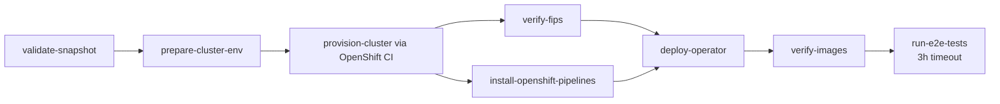

# OpenShift Builds E2E Integration Tests

The `e2e-openshift-builds` pipeline (`pipelines/konflux-e2e-complete-pipeline.yaml`) provisions an ephemeral
HyperShift cluster through OpenShift CI, deploys the OpenShift Builds operator from a Konflux snapshot, and runs the
full e2e test suite.

## Pipeline Parameters

| Parameter | Default | Description |
|-----------|---------|-------------|
| `SNAPSHOT` | test app JSON | Konflux snapshot JSON containing component names and container images. Provided automatically by Konflux integration tests. |
| `VERSION` | `""` | Version suffix for image content source mirrors (e.g. `-1-6`). Used to construct the ICSP entries that map `registry.redhat.io` images to Konflux-built mirrors. |
| `OCP_VERSION` | `4.22` | OpenShift minor version used for the stable release payload. |
| `COMPUTE_NODE_TYPE` | `m5.2xlarge` | AWS instance type used for HyperShift worker nodes. |
| `HYPERSHIFT_NODE_COUNT` | `3` | Number of HyperShift worker nodes. |
| `HOSTED_MANAGEMENT_CLUSTER` | `hosted-mgmt2` | Hosted management cluster used by OpenShift CI. |
| `TASKS_REPO_URL` | `https://github.com/redhat-openshift-builds/test.git` | Git repository URL containing the e2e task definitions. Override this to test tasks from a fork. |
| `TASKS_REPO_REVISION` | `main` | Git revision (branch, tag, or commit SHA) for the e2e task definitions. Override this alongside `TASKS_REPO_URL` when testing task changes before merging. |
| `DEBUG` | `false` | Set to `true` to dump cluster credentials (kubeadmin password, login command) and keep the cluster alive for 10 minutes after pipeline completion for manual investigation. |
| `BUILDS_SAMPLES_REPO` | `https://github.com/redhat-openshift-builds/samples.git` | Repository containing sample Build and BuildRun manifests used for smoke testing before the full e2e suite. |
| `BUILDS_SAMPLES_BRANCH` | `main` | Branch to clone from the builds samples repository. |
| `SHIPWRIGHT_BUILD_REPO` | `https://github.com/shipwright-io/build.git` | Shipwright Build repository containing the ginkgo e2e test suite and sample build strategies. |
| `SHIPWRIGHT_BUILD_BRANCH` | `main` | Branch to clone from the Shipwright build repository. |
| `IMAGE_EXPIRY_HOURS` | `1` | Hours until test images pushed to `quay.io/redhat-openshift-builds/e2e-test` expire and are auto-deleted by Quay. |

## Konflux Integration Test Configuration

Register `pipelines/konflux-e2e-complete-pipelinerun.yaml` as the IntegrationTestScenario resolver target and set
`spec.resolverRef.resourceKind` to `pipelinerun`. The PipelineRun binds a per-run 10Mi PVC for the
`shared-workspace`; the PVC is deleted with the PipelineRun.

## Execution Flow



- **validate-snapshot** runs first and fails fast if snapshot images are invalid.
- **prepare-cluster-env** writes all OpenShift CI environment options under `env-files/` in the shared workspace.
- **provision-cluster** uses the `aws-konflux-prod` profile with the `hypershift-hostedcluster-workflow` workflow and
  reads its environment through the provisioner's `env-files` workspace.
- **verify-fips** and **install-openshift-pipelines** run in parallel after cluster provisioning.
- **deploy-operator** waits for both to complete before deploying the operator bundle.

## Task Definitions

The cluster is provisioned by OpenShift CI's `provision-ephemeral-cluster` task. The remaining e2e task definitions
are stored under `tasks/` and referenced via git resolver:

| Task File | Description |
|-----------|-------------|
| `tasks/e2e-validate-snapshot.yaml` | Pre-cluster validation of snapshot images and bundle relatedImages |
| `tasks/e2e-prepare-cluster-env.yaml` | Writes OpenShift CI provisioning environment options |
| `tasks/e2e-verify-fips.yaml` | Verifies FIPS is enabled on all cluster worker nodes |
| `tasks/e2e-install-openshift-pipelines.yaml` | Installs OpenShift Pipelines operator via OLM subscription |
| `tasks/e2e-deploy-operator.yaml` | Deploys the operator bundle, verifies operands and CR status |
| `tasks/e2e-verify-images.yaml` | Verifies running operand images match the snapshot |
| `tasks/e2e-run-tests.yaml` | Runs sample BuildRuns and the Shipwright ginkgo e2e test suite |

## Testing with a Fork

To test task changes before merging to the release repository, override the task source parameters:

```yaml
params:
  - name: TASKS_REPO_URL
    value: "https://github.com/<your-fork>/release.git"
  - name: TASKS_REPO_REVISION
    value: "your-feature-branch"
```
